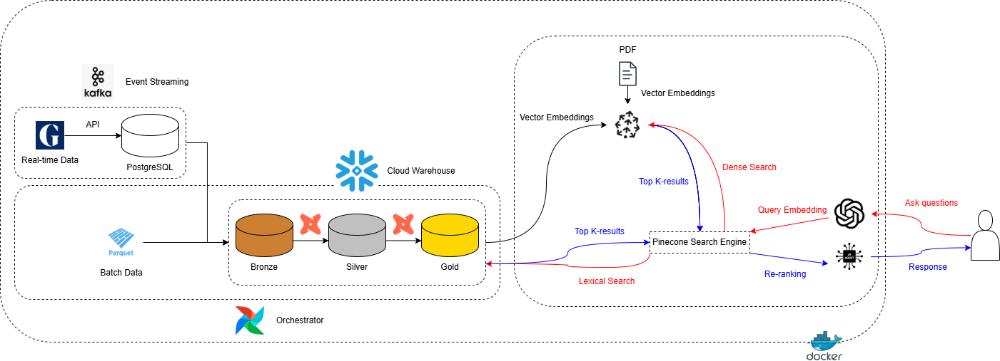
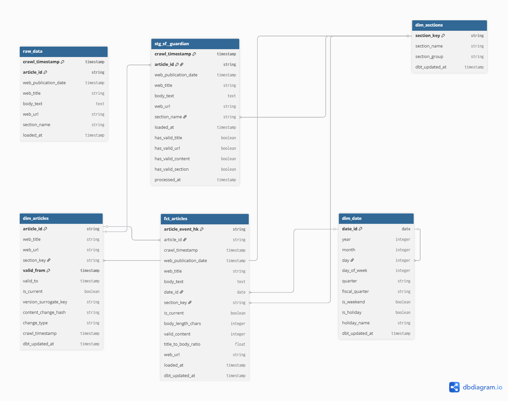

# Daily News Summarization Project 

## Overview
The Guardian News Analyst is an intelligent chatbot powered by a **hybrid RAG (Retrieval-Augmented Generation)** architecture that combines:

- **Dense Semantic Search** (Pinecone vector database) - Understanding meaning and context
- **Lexical SQL Search** (Snowflake keyword matching) - Exact phrase and entity matching
- **FlashRank Re-ranking** - Relevance optimization
- **LangGraph Agent Framework** - Conversational AI with tool calling
- **Persistent Memory** (PostgreSQL) - Conversation history across sessions

## Project Structure
### **1. Problem & Scope**:
The rapid pace of news publication requires real-time ingestion and analysis to stay relevant, while historical data provides context for long-term trends. Constraints include API rate limits, data quality issues, and ensuring AI responses are grounded in accurate data.

### **2. Personas/Stakeholders and Primary Use Cases:**  
- **Journalists:** Query news trends and sentiment for reporting.  
- **Analysts:** Analyze historical news patterns for research.  
- **General Users:** Ask natural language questions about news topics.  
- **Use Cases:** Real-time news monitoring, historical trend analysis, sentiment analysis via AI chatbot.

### **3. In/Out of Scope:**  
- **In Scope**: Real-time news ingestion, batch processing of historical news, AI-driven insights, data quality validation.  
- **Out of Scope**: Real-time social media integration, multi-language support, advanced ML model training.

### 4. Data Sources:
The Guardian News Analytics system uses a hybrid data ingestion architecture combining:

- Batch Processing - Historical archives from HuggingFace (500 articles)
- Real-time Streaming - Live Guardian API via Kafka (continuous updates)
- Incremental Loading - Smart sync to avoid duplicate processing
- Automated Orchestration - Airflow DAGs for reliable scheduling

### 5. Architecture Overview:

**High-level Diagram:**



#### **5.1. Data Pipeline:**

**5.1.1. Real-time Streaming Pipeline:**

**5.1.1.1. Kafka Producer:**
Purpose: Continuously poll Guardian API and stream new articles to Kafka.
Key Features:
- State Tracking: PostgreSQL table tracks processed articles (avoid duplicates)
- Incremental Polling: Only fetches articles not yet seen
- Smart Deduplication: Checks article_id against state before sending
- Rate Limiting: Handles Guardian API limits (sleeps on 429 errors)
- Continuous Mode: Runs indefinitely with configurable poll interval

**5.1.1.2. Kafka Consumer:**

Purpose: Consume articles from Kafka, validate, and sync to PostgreSQL → Snowflake.
Key Features:
- Batch Processing: Groups messages (50/batch) before Snowflake sync
- UPSERT Logic: Handles duplicates gracefully (ON CONFLICT DO UPDATE)
- Incremental Sync: Only uploads NEW rows to Snowflake (tracks loaded_at)
- Data Source Tagging: Automatically labels batch vs realtime based on date
- Connection Pooling: Reuses Snowflake connection (avoids overhead)
- Idempotent: Safe to re-run (won't create duplicates)

**5.1.2. Batch Data Processing Pipeline:**

**5.1.2.1. Batch Data Collector:**

Purpose: Download and preprocess historical Guardian articles from HuggingFace.
Key Features:
- Smart Caching: Only downloads if local data missing (idempotent)
- Quality Filtering: Only Data Quality == "Full" articles
- Schema Alignment: Transforms HuggingFace schema → Snowflake schema
- Sampling: Random sample of 500 articles (configurable)
- Streaming Processing: Uses Polars lazy evaluation for memory efficiency

**5.1.2.2. Batch Data Ingestion:**

Purpose: Upload preprocessed batch data to Snowflake using MERGE (safe upsert).
Key Features:
- Safe MERGE: Preserves existing data (updates data_source, never overwrites content)
- Idempotent: Can run multiple times safely
- Parquet Staging: Uses Snowflake internal stage for fast upload
- Data Source Tagging: Automatically sets data_source = 'batch'

**5.1.3. dbt Transformation:**

The dbt (data build tool) layer transforms raw Guardian article data into a **star schema** optimized for analytics and RAG retrieval. The pipeline implements:
- **Data Quality Validation** - Staging layer with comprehensive quality checks
- **SCD Type 2** - Tracks article version history (title/content changes)
- **Incremental Loading** - Efficient processing of only new/changed data
- **Star Schema** - Dimensions + Facts for fast analytical queries
- **Automated Testing** - 30+ data quality tests

#### **5.2. Tech Stacks:**

- **Python:** Flexible for data ingestion and processing (requests, polars).  
- **PostgreSQL:** Local staging for rapid development and testing.  
- **Snowflake:** Scalable cloud warehouse for analytics.  
- **dbt:** Industry-standard for data transformations.  
- **Kafka:** Robust for real-time streaming.  
- **Airflow:** Reliable pipeline orchestration.  
- **LangGraph/PineCone:** Enables conversational AI with grounded responses.  
- **OpenAI**: Open-source LLM API
- **GitHub Actions:** Simplifies CI/CD for deployment.  

#### **ERD:**



```dbml
Table raw_data {
  crawl_timestamp timestamp [pk]
  article_id string [pk, unique]
  web_publication_date timestamp
  web_title string
  body_text text
  web_url string
  section_name string
  loaded_at timestamp
  Note: 'Raw Guardian articles from Parquet ingestion'
}

Table stg_sf__guardian {
  crawl_timestamp timestamp [pk]
  article_id string [pk]
  web_publication_date timestamp
  web_title string
  body_text text
  web_url string
  section_name string
  loaded_at timestamp
  has_valid_title boolean
  has_valid_url boolean
  has_valid_content boolean
  has_valid_section boolean
  processed_at timestamp
  Note: 'Staging: Cleaned raw with quality flags'
}

Table dim_date {
  date_id date [pk]
  year integer
  month integer
  day integer
  day_of_week integer
  quarter string
  fiscal_quarter string
  is_weekend boolean
  is_holiday boolean
  holiday_name string
  dbt_updated_at timestamp
  Note: 'Date dimension with UK holidays (Guardian-focused)'
}

Table dim_sections {
  section_key string [pk, unique]
  section_name string
  section_group string
  dbt_updated_at timestamp
  Note: 'Section dimension with bucketing macro'
}

Table dim_articles {
  article_id string [pk]  // Composite PK with valid_from
  web_title string
  web_url string
  section_key string
  valid_from timestamp [pk]  // Composite PK with article_id
  valid_to timestamp
  is_current boolean
  version_surrogate_key string
  content_change_hash string
  change_type string
  crawl_timestamp timestamp
  dbt_updated_at timestamp
  Note: 'SCD Type 2: Versions on title/URL/section/body changes (PK: [article_id, valid_from])'
}

Table fct_articles {
  article_event_hk string [pk, unique]
  article_id string
  crawl_timestamp timestamp
  web_publication_date timestamp
  web_title string
  body_text text
  date_id date
  section_key string
  is_current boolean
  body_length_chars integer
  valid_content integer
  title_to_body_ratio float
  web_url string
  loaded_at timestamp
  dbt_updated_at timestamp
  Note: 'Fact: Article events with metrics (granular per crawl)'
}

// Relationships (star schema)
Ref: stg_sf__guardian.article_id > dim_articles.article_id  // Staging feeds SCD dim
Ref: stg_sf__guardian.section_name > dim_sections.section_key  // Normalized sections
Ref: fct_articles.date_id > dim_date.date_id  // Fact to date dim
Ref: fct_articles.section_key > dim_sections.section_key  // Fact to section dim
Ref: fct_articles.article_id > dim_articles.article_id  // Fact to article dim (current only)
Ref: dim_articles.section_key > dim_sections.section_key  // Article dim to section
Ref: "dim_date"."date_id" < "dim_date"."day"
```

#### **5.3. AI Agent Architecture**

```
┌─────────────────────────────────────────────────────────────────┐
│                         USER QUERY                              │
│              "What's the latest on climate change?"             │
└────────────────────────────┬────────────────────────────────────┘
                             │
                             ▼
┌─────────────────────────────────────────────────────────────────┐
│                    SMART QUERY ROUTING                          │
│  • Greetings/meta questions → Direct response (no retrieval)    │
│  • Factual queries → Hybrid retrieval pipeline                  │
└────────────────────────────┬────────────────────────────────────┘
                             │
                   ┌─────────┴─────────┐
                   │                   │
                   ▼                   ▼
     ┌──────────────────────┐  ┌──────────────────────┐
     │   DENSE SEARCH       │  │    SQL SEARCH        │
     │   (Pinecone)         │  │    (Snowflake)       │
     │                      │  │                      │
     │ • Semantic matching  │  │ • Keyword extraction │
     │ • 71,616+ vectors    │  │ • Multi-keyword OR   │
     │ • 2 namespaces:      │  │ • Optimized view     │
     │   - guardian_articles│  │ • Full-text search   │
     │   - user_documents   │  │                      │
     │ • K=10 results       │  │ • Limit=10 results   │
     └──────────┬───────────┘  └──────────┬───────────┘
                │                         │
                └────────┬────────────────┘
                         ▼
           ┌─────────────────────────┐
           │   MERGE & DEDUPLICATE   │
           │                         │
           │ • Remove duplicates     │
           │ • By article_id         │
           │ • By text similarity    │
           └────────────┬────────────┘
                        ▼
           ┌─────────────────────────┐
           │   FLASHRANK RERANKER    │
           │                         │
           │ • Local model (fast)    │
           │ • Relevance scoring     │
           │ • Top-K selection       │
           │ • Skip if <3 results    │
           └────────────┬────────────┘
                        ▼
           ┌─────────────────────────┐
           │   CONTEXT FORMATTING    │
           │                         │
           │ • Source labeling       │
           │ • Metadata enrichment   │
           │ • Retrieval stats       │
           └────────────┬────────────┘
                        ▼
┌─────────────────────────────────────────────────────────────────┐
│                    LANGGRAPH AGENT                              │
│                                                                 │
│  ┌──────────────┐    ┌──────────────┐    ┌──────────────┐       │
│  │   RETRIEVE   │───▶│   CHATBOT    │───▶│    TOOLS    │       │
│  │              │    │              │    │              │       │
│  │ • Query      │    │ • GPT-4o     │    │ • SQL search │       │
│  │   routing    │    │   mini       │    │ • Trending   │       │
│  │ • Hybrid     │    │ • Context    │    │ • Summaries  │       │
│  │   search     │    │   aware      │    │ • Metadata   │       │
│  │ • Context    │    │ • Tool       │    │              │       │
│  │   building   │    │   calling    │    │              │       │
│  └──────────────┘    └──────────────┘    └──────────────┘       │
│                                                                 │
│  Memory: PostgreSQL (conversation history, checkpoints)         │
└────────────────────────────┬────────────────────────────────────┘
                             ▼
                    ┌──────────────────┐
                    │  FINAL RESPONSE  │
                    │                  │
                    │ • Grounded       │
                    │ • Cited sources  │
                    │ • Conversational │
                    └──────────────────┘
```

---

**Project Structure:**
```
capstone/
├── .dbt
|   ├── .user.yml
|   ├── profiles.yml
├── .github/workflows
|   ├── pr_ci.yml
├── ai_agents/
|   ├──__init__.py
|   ├──__pycache__/
|   │   ├── __init__.cpython-313.pyc
|   │   ├── app.cpython-313.pyc
|   │   ├── baseline_systems.cpython-313.pyc
|   │   ├── capstone_tool_calling_agent.cpython-313.pyc
|   │   ├── cli_interface.cpython-313.pyc
|   │   ├── document_upload_ingestion.cpython-313.pyc
|   │   ├── persistent_agent.cpython-313.pyc
|   │   └── streamlit_app.cpython-313.pyc
|   │
|   ├── services/
|   │   ├── __init__.py
|   │   ├── __pycache__/
|   │   │   ├── __init__.cpython-313.pyc
|   │   │   ├── chunking_strategies.cpython-313.pyc
|   │   │   ├── document_processor.cpython-313.pyc
|   │   │   └── text_extractors.cpython-313.pyc
|   │   ├── chunking_strategies.py
|   │   ├── document_processor.py
|   │   └── text_extractors.py
|   │
|   ├── app.py
|   ├── baseline_systems.py
|   ├── capstone_tool_calling_agent.py
|   ├── cli_interface.py
|   ├── data_ingestion_to_pinecone.py
|   ├── demo_The_Guardian_article.pdf
|   ├── diagnostic.py
|   ├── document_upload_ingestion.py
|   ├── evaluation.py
|   ├── evaluation_results.json
|   ├── evaluation_results.png
|   ├── ground_truth.json
|   ├── ground_truth_llm.json
|   ├── improvement_chart.png
|   ├── label_ground_truth.py
|   ├── label_ground_truth_llm.py
|   ├── metrics_comparison.png
|   ├── test_document_upload.py
|   ├── test_queries.json
|   ├── test_retrieval_uploaded.py
|   ├── update_tracking_table_manual.py
|   └── visualize_results.py
├── capstone_dbt_project/
|   ├── .dbt
|   ├── .venv
|   ├── dbt_packages
|   ├── logs
|   ├── macros
|   ├── models
|   ├── seeds
|   ├── snapshot
|   ├── target
|   ├── tests
|   ├── .gitignore/
|   ├── README.md
|   ├── expressions.txt
|   ├── pyproject.toml/
|   ├── .sqlfluff
|   ├── .user.yml
|   ├── .dbt_project.yml
|   ├── package-lock.yml
|   ├── packages.yml
|   ├── profiles.yml
├── dags/  
|   ├── capstone_crawling_ingestion                   # Batch data crawling orchestrator
|   ├── capstone_dbt_orchestration                    # dbt run orchestration
├── scripts/  
|   ├── batch_data                                    # Batch Data scripts
|      ├── real_time_data_collector.py                # Guardian API ingestion
|      ├── batch_data_collector.py                    # HuggingFace historical news data crawling
|      ├── batch_data_ingestion.py                    # HuggingFace historical news data ingestion to Snowflake
|   ├── real_time_data
|      ├── kafka_consumer.py                          # Kafka Events Consumer 
|      ├── kafka_producer.py                          # Kafka Events Producer 
├── sql
|   ├── init.sql
├── .env.example 
├── .gitattributes/                    
├── .gitignore/                    
├── .python-version/                          
├── docker-compose-airflow.yml/    
├── docker-compose-kafka.yml/ 
├── docker-compose.yml/ 
├── Dockerfile.airflow/                      
├── main.py/                        
├── pyproject.toml/ 
├── requirements.txt/ 
├── setup_airflow_postgres_connection
├── setup_airflow_snowflake_connection
├── uv.lock/                       
└── README.md                     # Documentation
```

**Setup Instructions:**

**1. Clone Repository:**
``` 
git clone https://github.com/Dinhngoclam2906/fa-dae2-capstone-Dinh-Ngoc-Lam/
```

**2. Install Dependencies:**  
```
uv sync
```

**3. Start Docker Services:**
```  
docker-compose -f docker/compose.yml up -d
```

**4. Run Pipelines:**

Real-time: 
```python scripts/real_time_data/kafka_producer.py && python scripts/real_time_data/kafka_producer.py```

Batch: 
```python scripts/batch_data/batch_data_collector && python scripts/batch_data/batch_data_ingestion.py```

**5. Verify Data:** 
Check PostgreSQL and Snowflake for loaded data (500+ rows for batch, continuous updates for real-time).